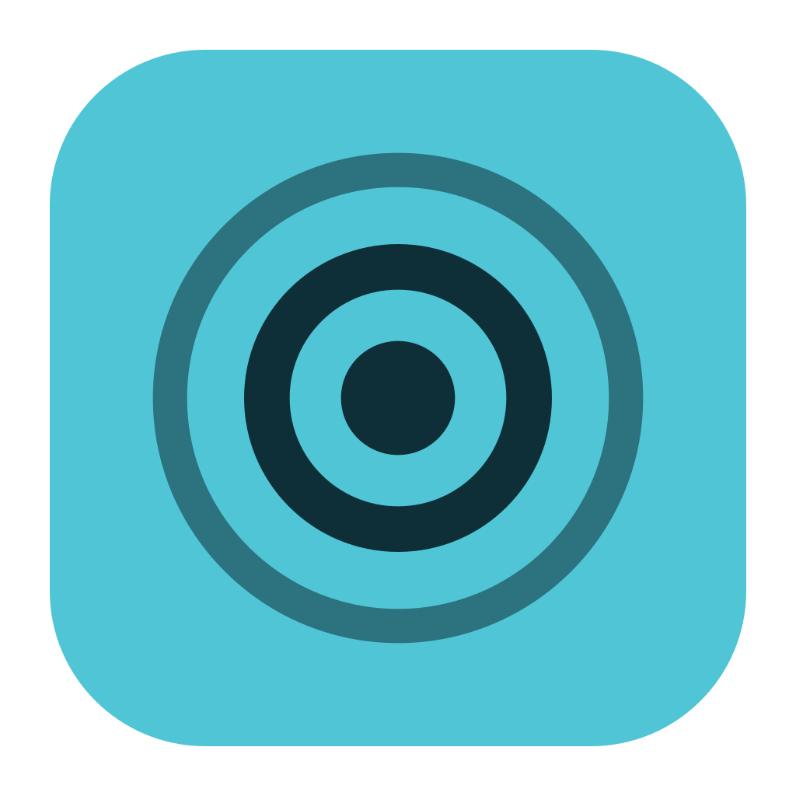

# Glassview

**Show your clicks and shortcuts on screen.**

Glassview is a small click and keystroke visualizer for macOS and Windows. It draws a
short ripple where you click and shows the shortcuts you press in a pill near the bottom
of the screen, so people watching a screen recording or a live demo can follow along.

It covers every display, including displays with different scaling, and it never takes
focus or gets in the way of your clicks and typing. Everything runs on your machine.
There's no account, no server, and nothing is recorded or sent over the network.

## Features

- **Click ripples:** a short, fading ripple at the pointer, in a different color for the
  left, right, and middle buttons. Pick the colors and the size.
- **Pointer halo:** an optional soft glow that follows the pointer.
- **Shortcut pill:** shortcuts appear as they're pressed, with modifiers combined
  (**⇧⌘P**, **Ctrl+Alt+Del**) and fast repeats merged (**⌘Z ×3**). The pill fades
  1.5 seconds after the last key, or after the delay you choose.
- **Shortcuts only by default:** typed text never appears unless you turn on all keys.
- **Every display:** each display gets its own overlay. The pill appears on the display
  under the pointer.
- **Out of the way:** a menu bar icon on macOS and a tray icon on Windows.

## Build from source

You'll need:

- Node.js 22.12 or newer
- Rust (stable)
- The [Tauri prerequisites](https://v2.tauri.app/start/prerequisites/) for your OS

Run it in development mode:

```sh
npm ci
npm run desktop tauri dev
```

Or build the app and its installer:

```sh
npm run desktop tauri build
```

On macOS this creates `Glassview.app` and a `.dmg`; on Windows, a setup `.exe`. You'll
find them in `apps/desktop/src-tauri/target/release/bundle/`.

## Using Glassview

Glassview starts on. On first launch, Settings opens to explain what it shows.

| Action | macOS | Windows |
| --- | --- | --- |
| Turn Glassview on or off (global) | ⌥⇧⌘K | Ctrl+Alt+Shift+K |

Left-click the menu bar or tray icon to open Settings next to the icon. The panel
opens beneath the icon, or above a bottom taskbar, and stays in place. Right-click
the icon to turn Glassview on or off, or quit. You can also use the switch in Settings.
The toggle shortcut is fixed in this version. If another app already uses it,
Settings says so and the icon still works.

Settings has:

- **Keys:** shortcuts only, or all keys. Pill size, pill position (a corner or bottom
  center), and how long the pill stays after the last key.
- **Clicks:** a ripple color for each mouse button, the ripple size, and the pointer halo.

Settings are saved between launches.

### macOS permission

Clicks work right away. To show shortcuts, macOS needs to let Glassview use **Input
Monitoring**. Settings explains this on first launch. Click **Allow…** and macOS asks for
permission. If you deny it, clicks still show. Settings and the menu bar item
**Allow key display…** then open **System Settings › Privacy & Security › Input
Monitoring**, where you can turn Glassview on at any time. Glassview notices the change
within a couple of seconds. If shortcuts still don't appear, Settings offers to relaunch.

Glassview doesn't ask for **Accessibility**. It only listens to input and never changes
or blocks it, and listening needs Input Monitoring alone.

## Privacy

- **Shortcuts only (the default).** A key appears only when it's pressed with
  Cmd, Ctrl, or Option on macOS, or Ctrl, Alt, or Win on Windows, and it doesn't type a
  character. Plain typing, Shift+letter, and characters typed with Option or AltGr
  (like `@` on many layouts) are never shown. A press without one of those modifiers is
  dropped before Glassview looks up which character it would type.
- **All keys.** Everything you type appears on screen. On Windows that includes
  passwords. On macOS, password fields turn on Secure Input, which hides those keys from
  every app, including Glassview.
- Glassview never writes keys to disk or to its log.

## Known limitations

- On Windows, Glassview can't see clicks or keys in apps running as administrator, such
  as Task Manager or an elevated terminal. Windows keeps that input from apps without
  administrator rights.
- After you connect, disconnect, rearrange, or rescale a display, the overlays can take
  up to 2 seconds to catch up.
- Dead keys (accent keys that combine with the next key) aren't shown, and neither are
  the extra mouse buttons such as back and forward.
- The macOS build uses private APIs for transparency, so it can't be distributed through
  the Mac App Store.

## Troubleshooting

Glassview keeps a log of errors, which is helpful to attach when you
[report an issue](https://github.com/ImNallen/Glassview/issues):

- macOS: `~/Library/Logs/dev.glassview.desktop/`
- Windows: `%LOCALAPPDATA%\dev.glassview.desktop\logs\`

If your settings can't be read, Glassview keeps the ones it can, resets the rest, and
saves the original file as `preferences.json.bak` next to `preferences.json`.

## Development

The repository is an npm workspace with one package:

| Path | Contents |
| --- | --- |
| `apps/desktop` | The desktop app (Tauri 2, Rust, Svelte 5) |
| `assets/brand` | Logo and icons, generated by `scripts/generate-brand-assets.py` |

Common commands:

```sh
npm run check         # type checks
npm test              # unit tests
npm run build         # build the frontend

cargo test   --manifest-path apps/desktop/src-tauri/Cargo.toml
cargo clippy --manifest-path apps/desktop/src-tauri/Cargo.toml -- -D warnings
npm run desktop tauri build -- --debug --no-bundle
```

The privacy filter, display layout, input routing, preferences, and the pill are plain
functions with unit tests that run on both platforms. Input capture, overlay placement,
and permissions only work in the real app, so check native changes on both macOS and
Windows, ideally with two displays at different scaling.

## License

Glassview is free and open source under the [MIT License](LICENSE). Use it, fork it,
and change it however you like.
